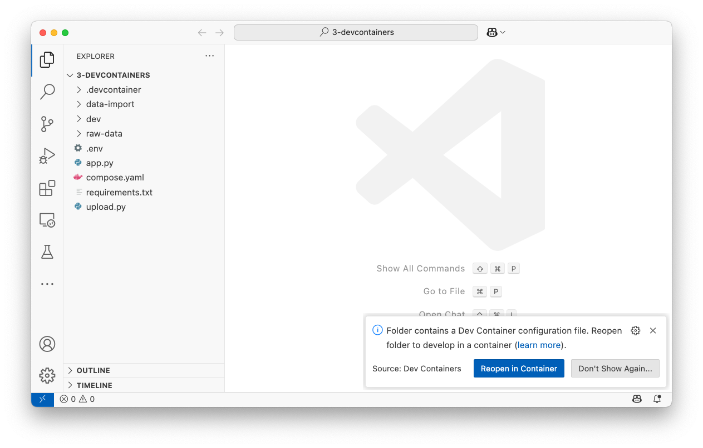

# Python Dash sample app

This application uses [Dash](https://dash.plotly.com/) to create a dashboard using data stored in a PostgreSQL database.

## Level 1

To experience Level 1, complete the following steps:

1. Navigate into the `1-native-app` directory.

    ```console
    cd 1-native-app
    ```

2. Start the app's dependencies using the following command:

    ```console
    docker compose up -d
    ```

    This will download all of the container images and start the database and visualizer, running them in the background.

    Once started, pgAdmin will be available at [http://localhost:8080](http://localhost:8080) (note that it may take a moment for it to finish bootstrapping and starting up).

3. Create a virtualenv with the following command:

    ```console
    python -m venv .
    ```

    If the `python` command fails, try using `python3`. If that still fails, go and [install Python](https://www.python.org/downloads/) and [virtualenv](https://virtualenv.pypa.io/en/latest/installation.html). Then try again.

4. Activate the virtualenv with the following command:

    ```console
    source ./bin/activate
    ```

5. Install the Python dependencies using pip:

    ```console
    pip install -r requirements.txt
    ```

6. Start the application with the following command:

    ```console
    python app.py
    ```

    Once it's started (it may take a few seconds on the first launch), access the site by going to [http://localhost:8050](http://localhost:8050).

From here, feel free to make any changes to the `app.py` file and validate you see the changes.

When you're done, tear it all down by pressing `Ctrl+C` in the terminal running the Python app and running `docker compose down`.

## Level 2

To experience Level 2, run the following commands:

1. Navigate into the `2-app-in-container` directory:

    ```console
    cd 2-app-in-container
    ```

2. Start the containers using the following Docker Compose command:

    ```console
    docker compose up --watch --build
    ```

    This will build the container image for the app and then start the app. The `--watch` flag will also continue to monitor for file changes and then sync those changes into the container.

3. Make changes to the `app.py` file and see the Compose log messages indicating the file is synced into the container.

### Additional notes

In order for the synced files to work, the dev container is utilizing the `watchdog` Python module. When this module exists, Flask will use watchdog to observe file changes to trigger server restarts.

This is why there is a separate `dev` stage in the `Dockerfile` - use the same base that would be used for production, but install additional dependencies needed for the development environment.


## Level 3

To experience Level 3, you will need to complete the following steps:

1. Install the [Devcontainers extension for VS Code](https://marketplace.visualstudio.com/items?itemName=ms-vscode-remote.remote-containers)

2. Open a new VS Code window and open the `3-devcontainers` directory.

3. You should be prompted to open the project in a devcontainer. Click the **Reopen in Container** button.

    

    Note that this may take a while to download the container image, perform the build, etc. So, be patient.

4. Eventually, you will get a message saying **Done. Press any key to close the terminal.** Feel free to press any key to close the terminal.

5. In a new terminal (you should see that you're in the `/workspace/dash-app` directory), start the Python app by running the following command:

    ```console
    python app.py
    ```

    Then, open your browser to see the app at [http://localhost:8050](http://localhost:8050).

While this is a Python environment, the Docker CLI has also been added, allowing you to run any `docker` commands in the terminal.


## Acknowledgement

This sample app is a modified version of the example found in the [Ploomber docs examples](https://github.com/ploomber/doc/tree/main/examples/dash/dash-connect-pgsql). The code is licensed under the Apache 2.0 license, although the repo's LICENSE file doesn't include a date and owner.